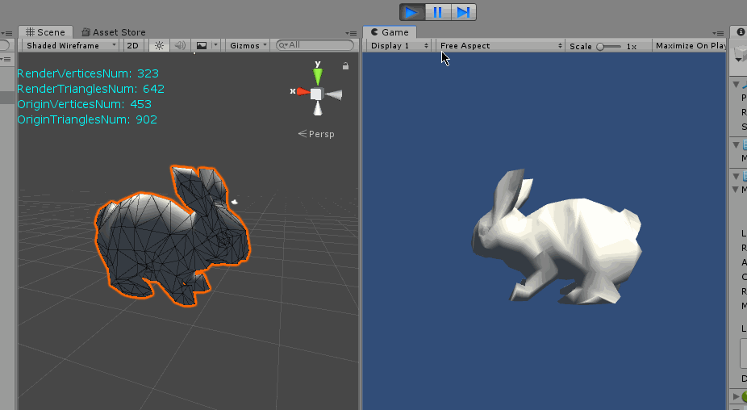
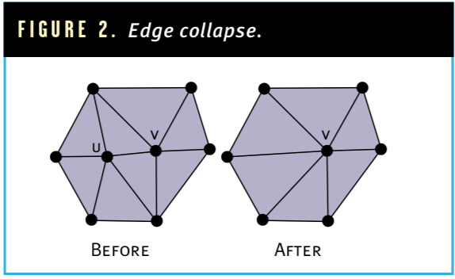
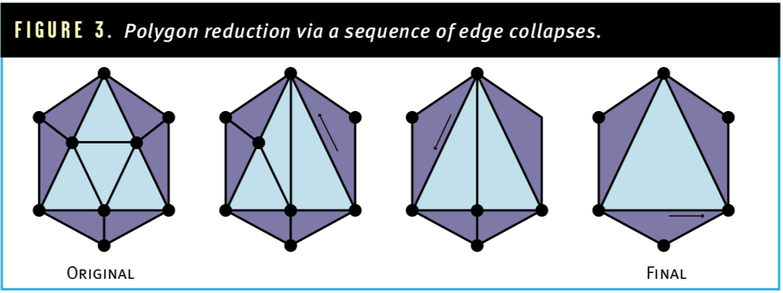
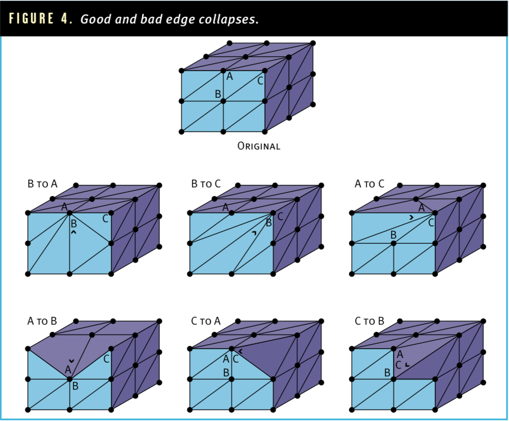

# SimplifyPolygon




该算法来源: 《A Simple, Fast, and Effective Polygon Reduction Algorithm》by Stam Melax.

> 原文链接：https://dev.gameres.com/Program/Visual/3D/PolygonReduction.pdf

源码（Unity）

> Github: https://github.com/vanCopper/SimplifyPolygon


#### H.Hoppe Progressive Meshes

多数减面算法都是**H.Hoppe Progressive Meshes**的改进或变形而来。**Progressive Meshes**是由**Hugues Hoppe** 1996年发表在***ACM SIGGRAPH（国际图形图像协会）* **的一篇论文。

> WebPage: http://hhoppe.com/proj/pm/
>
> Parper: http://hhoppe.com/pm.pdf
>
> Github: https://github.com/hhoppe/Mesh-processing-library/tree/master/MeshSimplify

该算法通过重复使用一个简单的边坍塌操作来降低模型的复杂度，如图2：



**u,v**是即将被操作的两点：

1. 首先删除以**uv**为边的三角形
2. 更新剩余三角形的顶点，用顶点**u**代替**v**
3. 移除顶点**u**

重复以上过程，直到当前剩余顶点数达到预期数量。该过程会移除一个顶点（**u**），两个三角形，三条边。

假设有图3所示多边形，通过上述过程即可完成减面操作：




#### Stam Melax 对算法的优化

算法核心是如何选择被删除的坍塌（**uv**）边，正确选择坍塌边才能最小程度的影响模型的外观视觉的变化。**Stam Melax**提出的优化算法有核心两点：

* 对于平面上的表面，只需要很少的面即可
* 对于高度弯曲的曲面则需要更多的面才能保证外观正确

所以确定一条边是否要坍塌，取决于**该条边的边长与曲率值的乘积**。边（**uv**)的曲率值则是通过比较相邻面的法线点积来得到，计算公式：


```c#
private float ComputeEdgeCollapseCost(SimplifyVertex u, SimplifyVertex v)
    {
        Vector3 tp = v.position - u.position;
        float edgelength = Vector3.SqrMagnitude(tp);
        float curvature = 0.0f; // 曲率

        List<SimplifyTriangle> sides = new List<SimplifyTriangle>();

        // 查找uv为边的三角形
        foreach (SimplifyTriangle simplifyTriangle in u.triangles)
        {
            if (simplifyTriangle.Contains(v))
            {
                sides.Add(simplifyTriangle);
            }
        }

        foreach (SimplifyTriangle triangle in u.triangles)
        {
            float mincurv = 1;
            foreach (SimplifyTriangle sTriangle in sides)
            {
                float dotprod = Vector3.Dot(triangle.normal, sTriangle.normal);
                mincurv = Mathf.Min(mincurv, (1.0f - dotprod) / 2.0f);
            }

            curvature = Mathf.Max(curvature, mincurv);
        }

        return edgelength * curvature;
    }
```


该算法对于脊状边的坍塌也是有效的，不管该脊是锐角或直角。如图4：



正确的脊状坍塌**B**可至**A**,**C**。**A**可至**C**。

如果**A**坍塌至**B**,或**C**坍塌至**A**，**C**坍塌至**B**, 均会导致模型外形的变化。

代码部分只实现了静态模型且没有贴图的算法演示，实际上如想应用还需要处理uv，顶点法线，非闭合面(有边的存在，如飘带，披风，Plane等，可将坍塌代价设置为较大值解决该问题)，以及表面断裂。

还有一种情况是多点拥有相同位置，但有不同的uv和normal，坍塌的时候因为无法找到正确的坍塌目标会导致模型出现镂空的问题。

#### 最后

Paper中作者有提供C++的版本，Unity算法演示见源码。